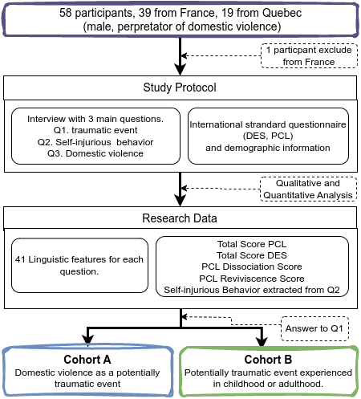

# Violent Men
This repository is associated with the analysis of the discourse from violent men. It is mainly design to reproduce the results presented in the paper: 
> "A psycholinguistic study of the traumatic discourse used by intimate partners violence"

>Abtract: This study examines psycholinguistic markers in two cohorts of intimate partner violence (IPV) perpetrators: those who identify domestic incidents as their primary trauma (Cohort A, n=29) and those whose trauma stems from childhood or other adult experiences (Cohort B, n=28). Using univariate and multivariate analyses on structured interview data, we identify significant linguistic variations correlating with PTSD and dissociation scales. Notably, narrative disorganization, speech disfluencies, present tense usage, and sensory detail exhibit significant differences between cohorts and align with clinical measures. Our multivariate analysis shows high adjusted R-squared values (>0.5 for Cohort A, >0.3 for Cohort B) when predicting PCL scale using linguistic features. Additionally, we explore the correlation of these linguistic markers with the presence or absence of self-injurious behaviors, finding strong effect sizes in this context. These findings suggest that both the type of trauma and the population significantly influence relevant linguistic features for diagnostic analysis. Furthermore, the strong effect sizes and adjusted R-squared values highlight the potential for linguistic markers to serve as new clinical diagnostic tools.




## Reproduce Paper Results
To reproduce the results of the paper, you need to follow the following steps:
0. Setup the environment
```bash
python3 -m venv venv_name
source venv_name/bin/activate
```

1. Clone the repository
```bash
git clone git@github.com:psycholinguistics2125/violent_men.git
```

2. Install the requirements
```python
pip install -r requirements.txt
```

3. Run the notebook reproduce_results.ipynb


## Investigating the pre-processing steps

The pre-processing steps are detailed in the notebook: main_preprocessing.py file. As the only data made publicly available is the ananymized data, the file is here only to satisfy the curiosity of the reader.

## Investigating the data

The data is stored in the data folder. The data is anonymized and the columns are the following:
- "code": the code of the participant
- "source": source of the interview, France or Quebec
- "TYPE_TRAUMA": the type of trauma, either childhood/adulthood or domestic, 1 for cohort A et 2 for cohort B
- "PCL_REVIVISCENCES": PCL score associated with Reviviscences items
- "PCL_DISSO": PCL score associated with Dissociation items
- "TOTAL_PCL_y": Total PCL score
- "TOTAL_DES_y": Total DES score
- "PA_Q2: Self-injurious behaviors,  0 for no, 1 for idea, 2 for attempt
- Q1_, Q2_, Q3_ : 41 language features associated with each question of the interview


